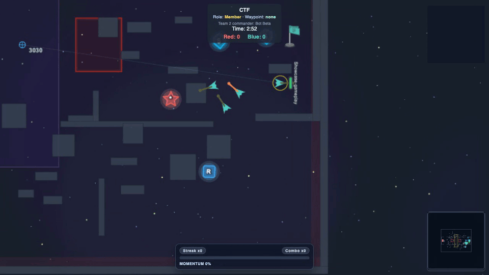
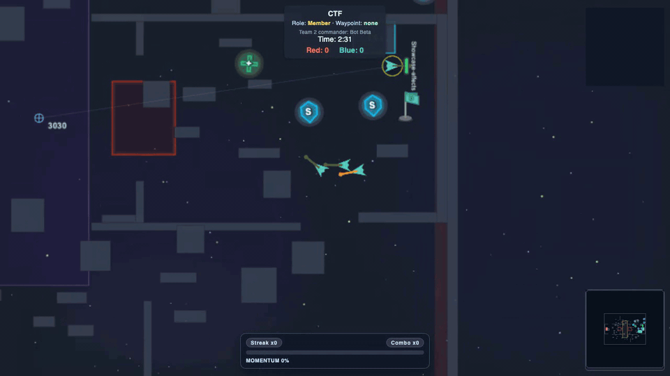
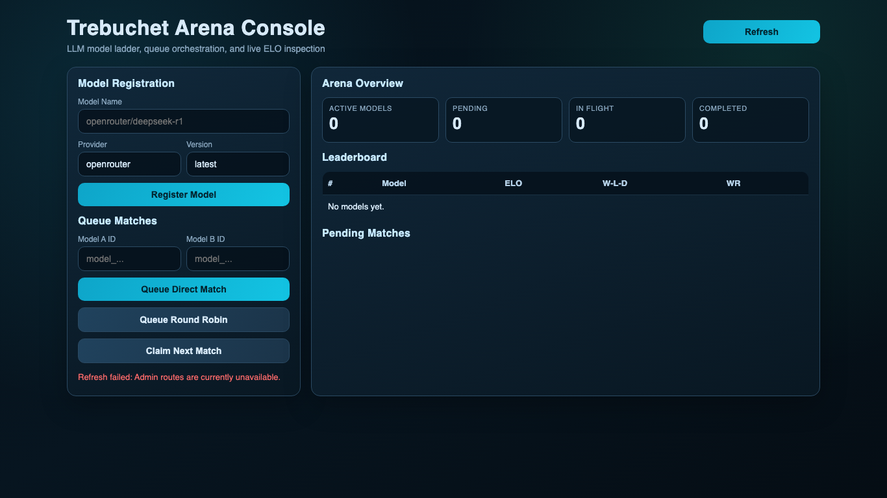
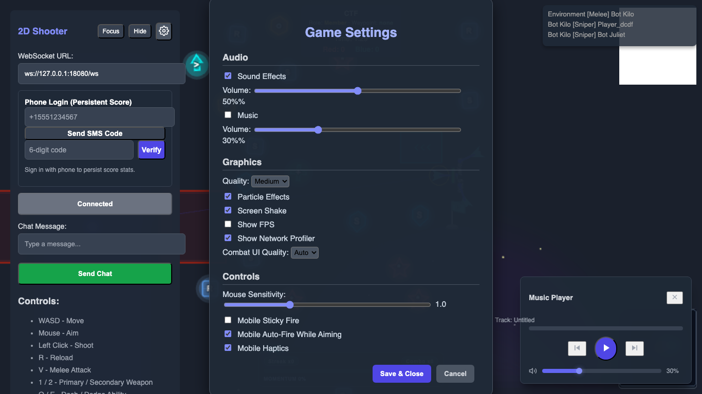
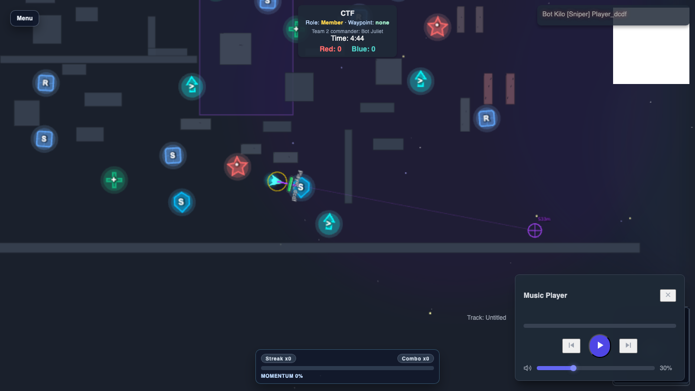
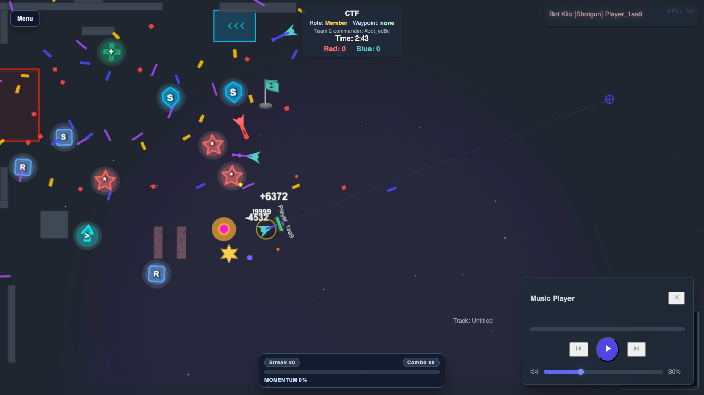

# Massive Game Server (Project Trebuchet Core)

Welcome to the Massive Game Server project! This is a high-performance game server written in Rust, designed from the ground up to handle a massive number of concurrent players and AI-controlled entities. It utilizes WebRTC for real-time client-server communication and FlatBuffers for efficient data serialization. This server is a core component of the Trebuchet Network initiative, aimed at pushing the boundaries of large-scale multiplayer interactions.

## Live Demo

Public live links are temporarily disabled until the hosted deployment is back online.

## Latest Gameplay & UI Showcase

Captured from a local March 4, 2026 build. GIFs are compressed for fast loading; MP4 links preserve full motion clarity.

### Combat and Effects

| Combat Push | FX Overload |
| --- | --- |
|  |  |

### Admin and Settings

| Arena Console | Settings Panel |
| --- | --- |
|  |  |

### In-Game Screenshots

| Crossfire Moment | Effects Snapshot |
| --- | --- |
|  |  |

### Short Video Captures

- [Gameplay Showcase (MP4)](docs/media/videos/gameplay_showcase.mp4)
- [Effects Showcase (MP4)](docs/media/videos/effects_showcase.mp4)

### What's New

- Security and reliability hardening across auth, signaling, QUIC, and deployment defaults, including stricter input validation, better route protection, and safer network policies.
- Gameplay and systems expanded with CTF improvements, spectator/replay flow refinements, progressive destructible terrain updates, and stronger anti-cheat/runtime correctness safeguards.
- Performance and scale optimizations in hot paths (spatial indexing, bot/navigation logic, state sync, and server loops) to improve frame stability under heavy player+bot load.
- CI and quality raised significantly with broader test coverage, automated security scanning (CodeQL/Trivy), and a coverage gate now enforced at 70%+ for core engine logic.

## Features

* **High-Performance Core:** Built in Rust for speed and safety.
* **Massive Scalability Focus:** Architected to support hundreds to thousands of entities.
* **Real-time 2D Shooter Base:** Includes fundamental gameplay logic for a 2D shooter.
* **WebRTC Networking:** Leverages WebRTC data channels for low-latency communication.
* **Efficient Serialization:** Uses FlatBuffers for compact and fast data exchange.
* **AOI (Area of Interest) System:** For efficient state synchronization to clients.
* **Configurable Server Parameters:** Tick rate, player sharding, and thread pools can be tuned for performance.
* **Basic Bot System:** Capable of simulating AI-controlled players for testing and gameplay.
* **Static Web Client:** Includes a single canonical HTML/JavaScript client (`static_client/client.html`) using Pixi.js for testing and visualization.

## Prerequisites

Before you begin, ensure you have the following installed:

* **Rust:** `rustc 1.86.0` or newer. Install via [rustup.rs](https://rustup.rs/).
* **Cargo:** `cargo 1.86.0` or newer (comes with Rust).
* **FlatBuffers Compiler (`flatc`):** `flatc version 25.2.10` or newer.
    * macOS: `brew install flatbuffers`
    * Ubuntu/Debian: `sudo apt-get install flatbuffers-compiler`
    * Other: Visit the [FlatBuffers Website](https://google.github.io/flatbuffers/).
* **(Optional) Node.js & npm:** Required if you plan to modify client-side TypeScript and recompile.
* **(Optional) TypeScript Compiler (`tsc`):** `Version 5.8.3` or newer (`npm install -g typescript`). Needed for `scripts/generate_flatbuffers.sh` if you modify the schema and want to recompile the client-side TypeScript.

## Getting Started

Follow these steps to get the server up and running:

1.  **Clone the Repository:**
    ```bash
    git clone [https://github.com/TrebuchetNetwork/massive_game_server.git](https://github.com/TrebuchetNetwork/massive_game_server.git) 
    # Replace with the actual URL if different, e.g., trebuchet_network
    cd massive_game_server 
    ```

2.  **Build the Server:**
    The server is located in the `server` subdirectory.
    ```bash
    cd server
    cargo build --release
    ```
    * **Note on FlatBuffers:** The `server/build.rs` script automatically uses `flatc` to compile the canonical FlatBuffers schema (`protocol/schemas/game.fbs`) into Rust code during the build process. `server/schemas/game.fbs` is a required mirror and must stay byte-identical.

3.  **Run the Server:**
    After a successful build:
    ```bash
     
    cargo run --release
    ```
    The server will start and log its status, typically indicating it's listening on `ws://0.0.0.0:8080/ws` and serving static files from `http://0.0.0.0:8080/`.

4.  **Test with the Static Web Client:**
    * Open the `http://localhost:8080/client.html` file (located in the root of the cloned repository, e.g., `massive_game_server/static_client/client.html`) in a modern web browser.
    * The client should provide an interface to connect to the WebSocket URL logged by the server (default: `ws://localhost:8080/ws`).

## Deploy Website (Docker)

Deploy the full website + game server stack:

```bash
docker compose -f docker/docker-compose.yml up -d --build
```

or:

```bash
DEPLOY_MODE=docker ./scripts/deploy.sh up
```

Before the first deploy, create secret files:

```bash
mkdir -p docker/secrets
printf '%s' '<openrouter-api-key>' > docker/secrets/openrouter_api_key
printf '%s' '<grafana-admin-user>' > docker/secrets/grafana_admin_user
printf '%s' '<grafana-admin-password>' > docker/secrets/grafana_admin_password
```

Details: `docker/secrets/README.md`.

Validate compose + nginx config before bringing services up:

```bash
DEPLOY_MODE=docker ./scripts/deploy.sh validate
```

Rollback to the previously running game-server image snapshot:

```bash
DEPLOY_MODE=docker ./scripts/deploy.sh rollback
```

Then open:
- `http://<host>:8080/` (landing website)
- `http://<host>:8080/client.html` (game client)
- `http://<host>:8080/models/` (league standings, model profiles, lore, chronicle)

Full deployment guide:
- `docs/deploy_website.md`
- `docs/game_trebuchet_network_deploy.md` (production runbook for `game.trebuchet.network`)

Baremetal helpers:
- `scripts/provision_tls_cert.sh` (Let's Encrypt into `docker/ssl/`)
- `scripts/install_compose_service.sh` (systemd autostart for Docker Compose stack)
- `scripts/verify_public_deploy.sh` (public DNS/TLS/endpoint verification)

## Scale Validation

Run the full backend + frontend scale suite:

```bash
./scripts/scale/run.sh
```

Results are written to `artifacts/scale/`.

### Measured concurrent-client capacity (2026-08-29)

Load-tested with the Rust `stress-client` harness (real WebRTC data-channel
clients, ramped at 2 clients/sec, ~45s full-concurrency hold per stage) against
a scratch server (`webrtc` 0.17.2, `MGS_MAX_WS_CONNECTIONS_PER_IP=0` to bypass
the per-IP handshake cap — required for any single-IP load test):

| Concurrent clients | Connection success | DC-open p50 / p95 / max | Game tick at full hold |
|---|---|---|---|
| 100 | 100/100 (100%) | 15ms / 26ms / 237ms | ~17/s |
| 200 | 200/200 (100%) | 16ms / 23ms / 224ms | ~10/s |
| 300 | 300/300 (100%) | 17ms / 31ms / 230ms | ~7-9/s |
| 400 | 400/400 (100%) | 18ms / 221ms / 1017ms | ~8/s |

So the server is **tested to 400 concurrent WebRTC clients** for connection
establishment and session stability (400 is also the design target;
"400+" beyond that is untested). The historical 60-150s connection-establishment
tail seen with `webrtc` 0.11 at 120+ clients is gone in 0.17.2 (worst DC-open
across 400 clients: ~1s; zero 30s timeouts). Known bottleneck: the game tick
degrades well below the 60/s target as player count grows (~8/s at 400 players
while using only ~4 of 224 CPU cores), so tick-rate scaling — not connection
establishment — is now the priority optimization target.

## UI Validation

Run a full UI validation pass (surface audit screenshots + headless connect/runtime checks):

```bash
./scripts/validate_ui.sh
```

By default it runs on `127.0.0.1:18080`. Override with:

```bash
MGS_PORT=28080 ./scripts/validate_ui.sh
```

Audit artifacts are written to `artifacts/ui_audit/<run-id>/`.

## Live UI Profiling

Run live in-browser profiling (FPS/long tasks/heap plus per-phase runtime breakdown):

```bash
./scripts/ui_profile.sh --url http://127.0.0.1:18080/client.html --ws ws://127.0.0.1:18080/ws --duration 30 --warmup 5 --out artifacts/ui_profile_baseline.json
```

For ultra mode:

```bash
./scripts/ui_profile.sh --url "http://127.0.0.1:18080/client.html?mode=ultra" --ws ws://127.0.0.1:18080/ws --duration 30 --warmup 5 --out artifacts/ui_profile_ultra.json
```

## Ultra Client Profile

For a dedicated high-density UI profile tuned for many on-screen objects, open:

```text
http://localhost:8080/client.html?mode=ultra
```

This forces ultra settings (`mode=ultra`, compact HUD, focus UI).
The default `client.html` now also auto-enables ultra mode when player density or sustained frame-time pressure is high.

For browser-first reliability with lighter visuals, open:

```text
http://localhost:8080/client.html?mode=stable
```

This runs `client.html` in stable mode (non-breaking protocol/UI with conservative render settings).

## Client-Side Schema Generation

The static web client (`static_client/`) uses JavaScript code generated from the FlatBuffers schema.
* The pre-generated JavaScript files are located in `static_client/generated_js/`.
* If you modify the FlatBuffers schema (`protocol/schemas/game.fbs`), you need to regenerate these client-side files. Keep `server/schemas/game.fbs` mirrored, then run:
    ```bash
    cd scripts
    ./generate_flatbuffers.sh
    ```
    This script uses `flatc` to generate TypeScript files and then (optionally, if `tsc` is installed) compiles them to JavaScript.
* Schema policy and enforcement details: `docs/flatbuffers_schema_policy.md`.

## Configuration

The primary server configuration can be found and modified in:
* `server/src/core/config.rs`
* `docs/environment_variables.md` (centralized runtime env var reference)

Key parameters include:
* `tick_rate`: The server's simulation frequency (e.g., 30 or 60 Hz).
* `num_player_shards`: For distributing player processing load.
* `max_players_per_match`: Maximum concurrent players/bots.
* `ThreadPoolConfig`: Defines the number of threads for various tasks (physics, networking, AI, etc.).
* `target_bot_count`: Default number of bots to spawn.

These are set to default values optimized for a 12-core development machine but should be tuned for your specific hardware and load requirements.

## Project Structure

A brief overview of the main directories:

* `/server`: Contains all the Rust server-side code.
    * `/server/src/core`: Fundamental types, constants, error handling, and configuration.
    * `/server/src/entities`: Logic for players, projectiles, and other game entities.
    * `/server/src/systems`: Core game systems like physics, AI, combat, and objectives.
    * `/server/src/world`: World partitioning, map generation, and spatial indexing.
    * `/server/src/network`: WebRTC signaling, data channel management, and network message handling.
    * `/server/src/concurrent`: Thread pools, concurrent data structures.
    * `/server/src/operational`: Monitoring, diagnostics, and tuning utilities.
    * `/protocol/schemas/game.fbs`: Canonical FlatBuffers schema defining the network protocol.
    * `/server/schemas/game.fbs`: Mirror copy used for compatibility checks.
    * `/server/src/main.rs`: The main entry point for the server application.
    * `/server/src/lib.rs`: The library crate root for `massive_game_server_core`.
* `/static_client`: Contains the HTML, JavaScript, and CSS for the static web client.
    * `/static_client/generated_js/`: JavaScript files auto-generated from `game.fbs` by `flatc`.
* `/scripts`: Utility shell scripts for tasks like generating FlatBuffers code.
* `/config`: Environment configuration files (`base.yaml`, `development.yaml`, `production.yaml`) used by `MGS_CONFIG_PATH`.
* `/docs`: (Placeholder) For additional documentation.

## Contributing

Contributions are welcome! We aim to make this a community-driven effort to explore the limits of massive-scale simulations. Please look out for a `CONTRIBUTING.md` file for guidelines on how to contribute, report issues, and propose features.

For now, if you're participating in the Project Trebuchet competition, please follow the specific guidelines provided for that event.

## License

This project is licensed under the **MIT License**. See the `LICENSE` file in the repository for full details.
