# Massive Game Server Architecture Overview

This document provides a high-level overview of the architecture for the massive_game_server. The system is designed for handling large-scale multiplayer interactions, leveraging Rust for performance and WebRTC for real-time communication.

## Core Components Diagram

The following diagram illustrates the main components and their primary interactions:

```mermaid
graph LR
    %% Client Side
    subgraph ClientApp [Web Client Application]
        direction LR
        UI[User Interface - HTML/Tailwind CSS]
        Renderer[2D Renderer - Pixi.js]
        ClientLogic[Client-Side Game Logic & Input]
        ClientNetwork[Client Network - WebSocket & WebRTC]
    end

    %% Network Communication Layer
    subgraph NetworkLayer [Network Communication]
        direction TB
        SignalingServer[Signaling Server - Warp WebSocket]
        WebRTCChannels[WebRTC Data Channels - UDP-like]
    end

    %% Server Side
    subgraph ServerInfrastructure [Massive Game Server - Rust Core]
        direction TB
        ServerNetwork[Network Interface - WebRTC/Signaling Handler]
        
        subgraph CoreSystems [Core Game Systems]
            direction TB
            InputProcessing[Input Processing]
            PlayerManagement[Player Manager & Sharding]
            AISystem[AI System - Bots & Behaviors]
            GameLogicSystem[Game Logic & Event Bus]
            PhysicsSystem[Physics Engine - Collision, Movement]
            StateSync[State Synchronization - AOI, Delta Encoding]
        end
        
        subgraph WorldSystems [World Management]
            direction TB
            WorldPartitioning[World Partition Manager]
            SpatialIndexing[Spatial Index - Players, Projectiles]
            MapManagement[Map & Object Management - Walls, Pickups]
        end

        subgraph SupportingSystems [Supporting Infrastructure]
            direction TB
            Serialization[Serialization - FlatBuffers]
            ThreadPools[Concurrent Thread Pools]
            Configuration[Server Configuration]
            Monitoring[Metrics & Monitoring]
        end
    end

    %% Client to Network Layer Connections
    ClientLogic -->|User Input| ClientNetwork
    ClientNetwork -->|WebSocket Signaling| SignalingServer
    ClientNetwork -->|WebRTC Data| WebRTCChannels
    ClientNetwork -->|Game State Updates| Renderer

    %% Network Layer to Server Connections
    SignalingServer -->|Establishes Connection| ServerNetwork
    WebRTCChannels -->|Game Data Input/State| ServerNetwork
    ServerNetwork -->|Raw Client Input| InputProcessing

    %% Server Core System Interactions
    InputProcessing --> PlayerManagement
    InputProcessing --> GameLogicSystem

    PlayerManagement <--> AISystem
    PlayerManagement <--> SpatialIndexing
    PlayerManagement <--> WorldPartitioning
    PlayerManagement --> StateSync

    AISystem --> GameLogicSystem
    AISystem --> PlayerManagement

    GameLogicSystem --> PhysicsSystem
    GameLogicSystem --> StateSync
    GameLogicSystem --> MapManagement
    GameLogicSystem --> PlayerManagement
    GameLogicSystem --> AISystem

    PhysicsSystem --> PlayerManagement
    PhysicsSystem --> MapManagement
    PhysicsSystem --> SpatialIndexing

    StateSync -->|Player/World Changes| Serialization
    Serialization -->|Serialized Data| ServerNetwork

    %% World Systems Interactions
    WorldPartitioning <--> SpatialIndexing
    WorldPartitioning <--> MapManagement
    MapManagement --> PhysicsSystem
    MapManagement --> StateSync

    %% Supporting Systems Interactions
    ThreadPools -->|Manages Threads for| CoreSystems
    ThreadPools -->|Manages Threads for| WorldSystems
    Configuration -->|Loads Config for| ServerInfrastructure
    Monitoring -->|Observes| ServerInfrastructure

    %% Style Definitions
    classDef clientFill fill:#E6F3FF,stroke:#A8D8FF,stroke-width:2px,color:#333
    classDef networkFill fill:#FFF3E0,stroke:#FFD180,stroke-width:2px,color:#333
    classDef serverFill fill:#E8F5E9,stroke:#A5D6A7,stroke-width:2px,color:#333

    class ClientApp clientFill
    class NetworkLayer networkFill
    class ServerInfrastructure serverFill
```

## Component Descriptions

### 1. Client Application (Browser)

- **User Interface (HTML/Tailwind CSS)**: Renders the game's UI, menus, and overlays.

- **2D Renderer (Pixi.js)**: Handles the visual representation of the game world, players, and effects.

- **Client-Side Game Logic & Input**: Manages user input, performs client-side prediction (if any), and handles basic game interactions.

- **Client Network (WebSocket & WebRTC)**:
  - Uses WebSocket for initial signaling with the Signaling Server.
  - Establishes and uses WebRTC Data Channels for sending player inputs and receiving game state updates directly from the game server.

### 2. Network Communication Layer

- **Signaling Server (Warp - WebSocket)**: Facilitates the initial handshake and WebRTC peer connection setup between clients and the game server. It does not handle game data itself.

- **WebRTC Data Channels**: Provide low-latency, UDP-like communication channels for real-time game data (inputs, state updates) between each client and the server's Network Interface.

### 3. Massive Game Server (Rust Core)

#### Network Interface
- Handles incoming WebRTC connections established via the Signaling Server.
- Receives raw input data from clients and sends serialized game state updates.

#### Core Game Systems
- **Input Processing**: Deserializes client inputs and queues them for the respective player entities.

- **Player Manager & Sharding**: Manages player states, connections, and distributes player processing across multiple shards/threads for scalability.

- **AI System (Bots & Behaviors)**: Controls non-player characters (NPCs/bots), including their decision-making, pathfinding, and actions.

- **Game Logic & Event Bus**: Implements the core game rules, objectives, scoring, combat resolution, and manages a global event system for inter-system communication.

- **Physics Engine**: Handles movement, collision detection, and resolution for all dynamic entities (players, projectiles).

- **State Synchronization (AOI, Delta Encoding)**: Determines what data each client needs to see based on their Area of Interest (AOI). Encodes state changes efficiently (delta compression) for network transmission.

#### World Management
- **World Partition Manager**: Divides the game world into manageable partitions or zones to optimize queries and processing for entities within those areas.

- **Spatial Indexing**: A data structure (e.g., grid, quadtree) used for fast spatial queries like "find all entities near point X" or "find entities in this rectangular area." Crucial for AOI, physics, and AI.

- **Map & Object Management**: Manages static and dynamic world objects like walls, pickups, and other environmental features.

#### Supporting Infrastructure
- **Serialization (FlatBuffers)**: Encodes and decodes game state and messages into an efficient binary format for network transmission.

- **Concurrent Thread Pools**: Manages pools of threads dedicated to different tasks (e.g., networking, physics, AI, game logic) to leverage multi-core processors.

- **Server Configuration**: Loads and manages server settings (tick rate, player limits, bot counts, etc.).

- **Metrics & Monitoring**: Collects and exposes performance metrics and operational data for diagnostics and tuning.

## Data Flow Highlights

1. **Client Connection**: Client connects to Signaling Server (WebSocket) → Signaling Server helps establish WebRTC Data Channel with Game Server.

2. **Client Input**: Client sends input (e.g., movement, shooting) over WebRTC Data Channel → Server Network Interface → Input Processing → Player Manager → Game Logic.

3. **Game Simulation**:
   - AI System updates bot actions.
   - Game Logic processes player/AI actions, resolves combat, manages objectives.
   - Physics System updates positions, detects collisions.
   - World/Spatial Index is updated with new entity states.

4. **State Synchronization**:
   - State Sync system determines relevant updates for each client based on AOI.
   - Changes are delta-encoded and serialized using FlatBuffers.
   - Serialized data is sent via WebRTC Data Channels from Server Network Interface to clients.

5. **Client Rendering**: Client receives state updates → deserializes → updates local game state → Renderer displays the changes.

This architecture aims for high concurrency and performance by sharding player processing, utilizing efficient data structures, and employing optimized networking and serialization techniques.